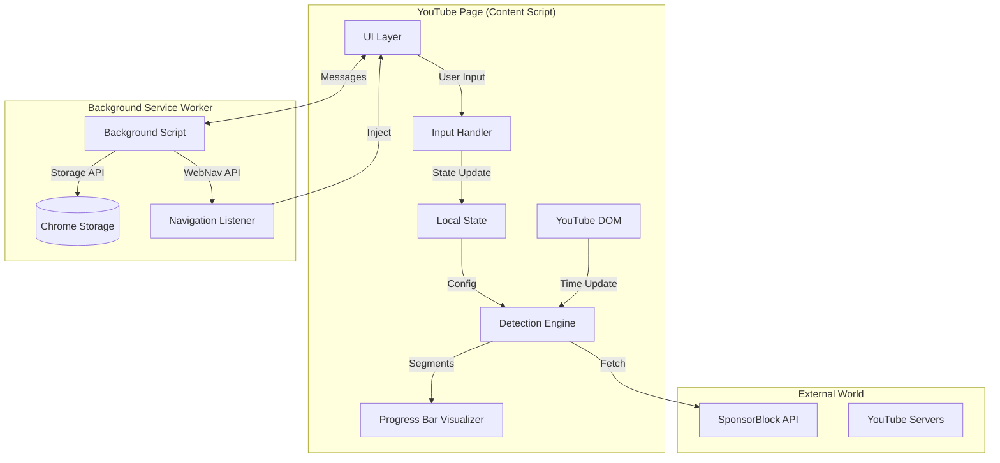

# Code Mastery: YouTube Auto Skipper

> **Objective:** This document is designed to take a new developer from "zero" to "master" of the codebase. It covers architecture, file structure, critical logic, and data flow.

---

## 1. High-Level Architecture

The extension follows a **Layered Event-Driven Architecture**. It operates within the browser's isolated environments but coordinates via message passing.



### Data Flow
1.  **Initialization:** When a video loads, the `ContentScript` initializes. It fetches settings from `Chrome Storage` via the `Background Script`.
2.  **Detection:** The `TieredFetcher` engine runs 3 strategies in parallel/sequence to find skip segments.
3.  **Execution:** The `ContentScript` listens to the video's `timeupdate` event. If the current time matches a segment, it triggers an action (Skip/Mute).
4.  **Feedback:** The `NotificationManager` shows a toast, and stats are sent to the `Background Script` for persistence.

---

## 2. Directory Map

```text
src/
├── background/          # Service Worker (runs in background)
│   └── index.ts         # Entry point: handles navigation & messaging
├── config/              # Configuration & Constants
│   └── constants.ts     # Centralized selectors, timeouts, styles
├── content/             # Content Scripts (runs on YouTube page)
│   └── simple-skipper.ts # MAIN ORCHESTRATOR: The "Brain" of the frontend
├── engine/              # Core Logic
│   ├── tieredFetcher.ts # Logic to decide WHICH source to trust
│   └── normalizeSegments.ts # Standardizes data from different sources
├── features/            # Feature Modules
│   ├── adSkipper.ts     # Logic to click "Skip Ad" buttons
│   └── InputHandler.ts  # Keyboard shortcut logic
├── pipeline/            # Data Fetching Strategies
│   ├── chapterScraper.ts # Tier 1: Scrapes description
│   └── transcriptParser.ts # Tier 3: Analyzes captions
├── services/            # Shared Services
│   └── InjectorService.ts # Injects scripts into page context
├── types/               # TypeScript Definitions
│   └── types.ts         # Shared interfaces (Segment, Cue)
├── ui/                  # User Interface
│   ├── NotificationManager.ts # Toast notifications
│   └── ProgressBarVisualizer.ts # Red markers on the timeline
└── utils/               # Utilities
    └── Logger.ts        # Centralized logging
```

---

## 3. Key File Breakdown

### `src/content/simple-skipper.ts`
**Responsibility:** The main entry point for the content script. It ties everything together.
**Connections:** Imports `TieredFetcher` to get data, `InputHandler` for controls, and `NotificationManager` for UI.
**Why it matters:** If the extension isn't working, start debugging here. It sets up the `MutationObserver` to detect video changes (SPA navigation).

### `src/engine/tieredFetcher.ts`
**Responsibility:** Decides *how* to find sponsor segments.
**Logic:**
1.  **Tier 1 (Fastest):** Checks video description for "Sponsor" chapters.
2.  **Tier 2 (Best Coverage):** Calls SponsorBlock API.
3.  **Tier 3 (Fallback):** Downloads transcript and looks for keywords.
**Why it matters:** This ensures we almost always find segments without relying on a single source.

### `src/config/constants.ts`
**Responsibility:** Holds all "magic values".
**Why it matters:** Never hardcode a CSS selector or timeout again. Change it here, and it updates everywhere.

---

## 4. Function Logic Deep Dive

### Critical Function 1: `checkForSkip(video)`
**Location:** `src/content/simple-skipper.ts`
**Purpose:** The "heartbeat" of the extension. Runs every ~500ms to decide if we should skip.

```typescript
function checkForSkip(video: HTMLVideoElement) {
  // 1. Defensive Checks: If disabled or no segments, exit immediately.
  if (!state.isEnabled || !currentSegments.length) return;

  const currentTime = video.currentTime;

  // 2. Iterate through all known segments
  for (let i = 0; i < currentSegments.length; i++) {
    const segment = currentSegments[i];

    // 3. Range Check: Is the user currently INSIDE a segment?
    if (currentTime >= segment.start && currentTime < segment.end) {
      
      // 4. Cooldown Check: Did we just skip this? (Prevents loops)
      const lastSkipTime = lastSkipTimes.get(i) || 0;
      const now = Date.now();
      // We can skip if we haven't skipped this specific segment in the last 3 seconds
      const canSkip = !skippedSegments.has(i) || now - lastSkipTime > 3000;

      if (canSkip) {
        // 5. EXECUTE: Perform the skip/mute action
        executeSkipAction(video, segment, i);
        break; // Exit loop, we handled the event
      }
    }
  }
}
```

### Critical Function 2: `getSegmentsByPriority(videoId)`
**Location:** `src/engine/tieredFetcher.ts`
**Purpose:** The strategy pattern implementation for finding data.

```typescript
export async function getSegmentsByPriority(videoId: string): Promise<Segment[]> {
  try {
    // 1. Try Tier 1 (Local Data) - Fastest, 0 network cost
    const chapters = await scrapeChapterSegments();
    if (chapters.length) return normalizeSegments(chapters);

    // 2. Try Tier 2 (Crowdsourced API) - High accuracy
    const sb = await fetchSponsorBlockSegments(videoId);
    if (sb.length) return normalizeSegments(sb);

    // 3. Try Tier 3 (Heuristics) - Fallback, can be messy
    const transcript = await parseTranscriptSegments();
    return normalizeSegments(transcript);
  } catch (error) {
    // 4. Fail Gracefully: Return empty array so video still plays
    return [];
  }
}
```

### Critical Function 3: `InjectorService.injectTrackUrlFetcher(tabId)`
**Location:** `src/services/InjectorService.ts`
**Purpose:** Breaks out of the "Isolated World" to access the page's global variables.

```typescript
static injectTrackUrlFetcher(tabId: number) {
  return chrome.scripting.executeScript({
    target: { tabId },
    world: 'MAIN', // <--- CRITICAL: Runs in the PAGE context, not extension context
    func: () => {
      // This code runs inside the actual YouTube page
      // It can access 'window.ytInitialPlayerResponse' which is normally hidden from extensions
      const resp = window.ytInitialPlayerResponse;
      // ... logic to find caption URL ...
      
      // Send data back to the extension via window messaging
      window.postMessage({ type: 'SPONSORSKIP_TRACK_URL', payload: url }, '*');
    },
  });
}
```

---

## 5. "The Glue": Communication

The extension has 3 distinct parts that need to talk to each other:

1.  **Popup (UI) <-> Background:**
    *   **Method:** `chrome.runtime.sendMessage`
    *   **Use Case:** User changes settings in the popup. The popup sends `SETTINGS_UPDATED` to the background (or directly to content script if active).

2.  **Content Script <-> Background:**
    *   **Method:** `chrome.runtime.sendMessage`
    *   **Use Case:** Content script reports "I skipped a segment" (`INCREMENT_SKIP`). Background script saves this to `chrome.storage`.

3.  **Content Script <-> Page (DOM):**
    *   **Method:** `window.postMessage`
    *   **Use Case:** The `InjectorService` (in Page Context) finds the transcript URL and posts it. The Content Script listens for `message` events to receive it.

### Example: Changing a Setting
1.  User clicks "Mute Mode" in Popup.
2.  Popup sends `{ type: 'SETTINGS_UPDATED', settings: { sponsorAction: 'mute' } }`.
3.  Content Script receives message -> Updates local `state` variable.
4.  Next `timeupdate` loop uses the new `mute` logic.
