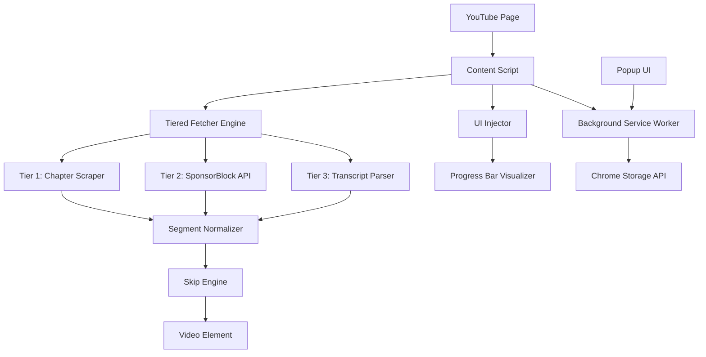
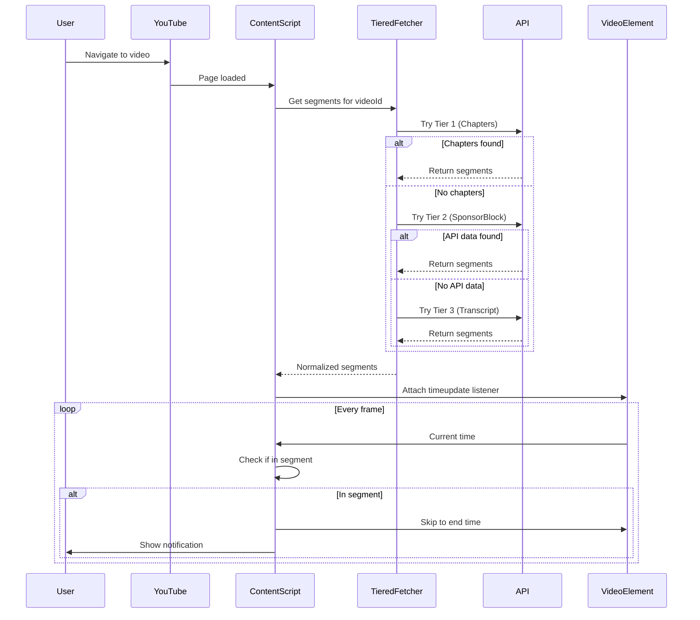

# YouTube Auto Skipper - Complete Project Documentation

## Table of Contents
1. [Problem Statement](#problem-statement)
2. [Project Overview](#project-overview)
3. [Key Features](#key-features)
4. [System Architecture](#system-architecture)
5. [Core Modules](#core-modules)
6. [Technical Implementation](#technical-implementation)
7. [Technology Stack](#technology-stack)
8. [Testing Strategy](#testing-strategy)
9. [Build & Deployment](#build--deployment)
10. [Interview Preparation](#interview-preparation)

---

## Problem Statement

### The Challenge
YouTube videos often contain sponsored segments and advertisements that disrupt the viewing experience. While YouTube provides a "Skip Ad" button for pre-roll ads, in-video sponsored content requires manual seeking, which is:
- **Time-consuming**: Users must manually identify and skip sponsor segments
- **Inconsistent**: Not all creators mark sponsored content clearly
- **Frustrating**: Interrupts the flow of content consumption

### The Solution
YouTube Auto Skipper is a browser extension that **automatically detects and skips** sponsored segments and advertisements in YouTube videos using a sophisticated three-tiered detection system, providing a seamless viewing experience.

---

## Project Overview

**YouTube Auto Skipper** (also known as **SponsorSkip**) is a Chrome extension built with TypeScript that enhances the YouTube viewing experience by automatically detecting and skipping unwanted content segments.

### What Makes It Unique?
- **Three-Tiered Detection System**: Combines multiple data sources for maximum accuracy
- **Real-time Processing**: Detects and skips segments as the video plays
- **Visual Feedback**: Progress bar visualization shows segment locations
- **User Control**: Toggle button and customizable settings
- **Statistics Tracking**: Monitors time saved and skip counts

### Target Users
- Frequent YouTube viewers who want uninterrupted content
- Users who value their time and want to skip repetitive sponsored content
- Content consumers who prefer a streamlined viewing experience

---

## Key Features

### 1. **Automatic Sponsor Detection & Skipping**
- Detects sponsored segments using three independent methods
- Automatically skips or mutes segments based on user preference
- Supports multiple skip actions: skip, mute, or notify only

### 2. **Three-Tiered Detection System**
The extension uses a fallback hierarchy for maximum coverage:

#### **Tier 1: Description Chapter Scraping**
- Parses video description for timestamp-based chapters
- Identifies chapters labeled as "Sponsor" or similar keywords
- **Advantage**: Fastest, uses creator-provided data
- **Limitation**: Only works if creator marks sponsors in description

#### **Tier 2: SponsorBlock API Integration**
- Queries the community-driven SponsorBlock database
- Retrieves crowd-sourced sponsor segment timestamps
- **Advantage**: Large database, high accuracy
- **Limitation**: Requires community contributions

#### **Tier 3: Transcript Heuristic Analysis**
- Downloads and analyzes video transcripts
- Uses keyword detection to identify sponsor mentions
- **Advantage**: Works even without external data
- **Limitation**: May have false positives/negatives

### 3. **Visual Progress Bar Overlay**
- Displays colored segments on the YouTube progress bar
- Shows sponsor locations before they occur
- Color-coded indicators for different segment types

### 4. **YouTube Ad Skipping**
- Automatically clicks the "Skip Ad" button when available
- Uses requestAnimationFrame for instant detection
- Advances video timeline during unskippable ads

### 5. **User Interface Controls**
- **Toggle Button**: Enable/disable auto-skip functionality
- **Badge Counter**: Shows number of detected segments (hidden by default)
- **Popup Panel**: Configure settings and view statistics
- **Keyboard Support**: Accessible controls with ARIA attributes

### 6. **Statistics & Analytics**
- Tracks total number of skips
- Calculates total time saved
- Persistent storage across sessions

### 7. **SPA Navigation Handling**
- Detects YouTube's Single Page Application navigation
- Re-initializes on video changes without page reload
- Robust observer patterns for dynamic content

---

## System Architecture

### High-Level Architecture



### Component Interaction Flow

1. **Initialization**
   - Content script loads when YouTube page is detected
   - UI components are injected into the player controls
   - Settings are loaded from Chrome storage

2. **Segment Detection**
   - Video ID is extracted from URL
   - Tiered fetcher attempts each detection method in order
   - First successful method returns segments
   - Segments are normalized to a common format

3. **Skip Execution**
   - Video `timeupdate` event triggers skip checks
   - Current time is compared against segment boundaries
   - Skip action is executed (skip/mute) based on settings
   - Notification is displayed to user

4. **UI Updates**
   - Progress bar visualizer draws segment markers
   - Badge counter updates with segment count
   - Statistics are updated and persisted

### Design Patterns Used

#### **1. Strategy Pattern** (Tiered Fetcher)
- Multiple detection strategies (Chapter, API, Transcript)
- Fallback mechanism for robustness
- Easy to add new detection methods

#### **2. Observer Pattern** (SPA Navigation)
- MutationObserver watches for DOM changes
- Event listeners for YouTube navigation events
- Automatic re-initialization on route changes

#### **3. Service Pattern** (Notification & Injection)
- Encapsulated services for specific functionality
- Reusable across different components
- Clear separation of concerns

#### **4. Singleton Pattern** (Progress Bar Visualizer)
- Single instance manages all visual overlays
- Prevents duplicate UI elements
- Centralized state management

---

## Core Modules

### 1. **Content Script** (`src/content/simple-skipper.ts`)
**Purpose**: Main orchestrator that runs on YouTube pages

**Key Responsibilities**:
- Initialize extension when video element is found
- Load user settings from Chrome storage
- Coordinate segment detection and skipping
- Handle video event listeners
- Manage UI components
- Process messages from popup

**Important Functions**:
- `initialize()`: Sets up video observers and event listeners
- `loadSegments()`: Triggers segment detection for current video
- `checkForSkip()`: Evaluates current playback position against segments
- `setupVideoEventListeners()`: Attaches all video event handlers

**Technical Highlights**:
- Uses MutationObserver to detect video element on SPA navigation
- Implements debouncing for segment loading
- Handles both sponsor skipping and ad skipping simultaneously

---

### 2. **Tiered Fetcher Engine** (`src/engine/tieredFetcher.ts`)
**Purpose**: Orchestrates the three-tiered detection system

**Algorithm**:
```typescript
async function getSegmentsByPriority(videoId: string) {
  // Tier 1: Try description chapters
  const chapters = await scrapeChapterSegments();
  if (chapters.length) return normalize(chapters);
  
  // Tier 2: Try SponsorBlock API
  const apiSegments = await fetchSponsorBlockSegments(videoId);
  if (apiSegments.length) return normalize(apiSegments);
  
  // Tier 3: Fallback to transcript analysis
  const transcriptSegments = await parseTranscriptSegments();
  return normalize(transcriptSegments);
}
```

**Why This Approach?**
- **Performance**: Fastest method tried first
- **Reliability**: Multiple fallbacks ensure coverage
- **Accuracy**: Community data preferred over heuristics

---

### 3. **Chapter Scraper** (`src/pipeline/chapterScraper.ts`)
**Purpose**: Extract sponsor segments from video description chapters

**How It Works**:
1. Clicks "Show more" button to expand description
2. Finds all anchor tags with timestamps in text
3. Parses timestamps (MM:SS or HH:MM:SS format)
4. Identifies chapters with "sponsor" keyword
5. Calculates start/end times for each segment

**Technical Challenges**:
- YouTube's dynamic DOM requires retry logic
- Timestamp parsing must handle multiple formats
- Chapter titles may be in sibling elements

**Key Function**:
```typescript
async function scrapeChapterSegments(): Promise<Segment[]>
```

---

### 4. **SponsorBlock API Client** (`src/api/SponsorBlockClient.ts`)
**Purpose**: Fetch crowd-sourced sponsor data

**API Endpoint**:
```
https://sponsor.ajay.app/api/skipSegments?videoID={videoId}
```

**Response Processing**:
- Filters for "sponsor" category segments
- Converts API format to internal Segment type
- Handles network errors gracefully

**Advantages**:
- Large community database
- High accuracy for popular videos
- No client-side processing required

---

### 5. **Transcript Parser** (`src/pipeline/transcriptParser.ts`)
**Purpose**: Analyze video transcripts for sponsor mentions

**Detection Algorithm**:
1. Opens YouTube's transcript panel
2. Parses all transcript segments with timestamps
3. Searches for sponsor-related keywords using regex
4. Groups consecutive sponsor mentions into segments
5. Applies confidence scoring

**Sponsor Keywords**:
- "sponsor", "sponsored", "advertisement"
- "promotion", "promoted", "thanks to"
- "brought to you by", "paid promotion"
- And more...

**Heuristic Logic**:
- Uses whole-word matching to avoid false positives
- Extends segments if keywords appear within 60 seconds
- Assigns confidence scores based on keyword density

**Technical Implementation**:
```typescript
// Whole-word regex matching
const sponsorRegexes = keywords.map(
  kw => new RegExp(`\\b${kw}\\b`, 'i')
);

// Segment grouping with gap detection
if (cue.start - currentSegment.end > 60) {
  // 60 second gap ends the segment
  segments.push(currentSegment);
  currentSegment = null;
}
```

---

### 6. **UI Injector** (`src/ui/UIInjector.ts`)
**Purpose**: Inject toggle button and controls into YouTube player

**Features**:
- Finds YouTube player controls container with retry logic
- Creates accessible toggle button with ARIA attributes
- Handles SPA navigation re-injection
- Prevents duplicate UI elements

**Injection Strategy**:
- Tries multiple selectors (`.ytp-left-controls`, `.ytp-right-controls`)
- Uses MutationObserver to detect DOM changes
- Listens for `yt-navigate-finish` events
- Implements injection locking to prevent race conditions

**Accessibility**:
- Full keyboard support (Enter/Space)
- ARIA labels and pressed states
- Visual feedback on state changes

---

### 7. **Progress Bar Visualizer** (`src/ui/ProgressBarVisualizer.ts`)
**Purpose**: Draw colored segment markers on YouTube progress bar

**Rendering Approach**:
- Creates overlay div positioned absolutely over progress bar
- Calculates segment positions as percentages of video duration
- Uses CSS for smooth animations and hover effects

**Visual Design**:
- Red segments for sponsors
- Semi-transparent for visibility
- Hover tooltips showing segment times

**Performance Optimization**:
- Only re-renders when segments change
- Uses CSS transforms for smooth animations
- Debounces resize events

---

### 8. **Background Service Worker** (`src/background/index.ts`)
**Purpose**: Handle extension lifecycle and storage

**Responsibilities**:
- Initialize default settings on installation
- Manage Chrome storage API interactions
- Handle messages between popup and content scripts
- Maintain extension state

---

### 9. **Notification Service** (`src/services/NotificationService.ts`)
**Purpose**: Display user-friendly notifications

**Features**:
- Toast-style notifications
- Auto-dismiss after timeout
- Positioned to avoid blocking content
- Customizable styling

---

## Technical Implementation

### Data Flow



### Key Algorithms

#### **1. Segment Normalization**
```typescript
function normalizeSegments(segments: Segment[]): Segment[] {
  return segments
    .filter(seg => seg.start < seg.end) // Valid segments only
    .sort((a, b) => a.start - b.start)  // Sort by start time
    .reduce((acc, curr) => {
      // Merge overlapping segments
      const last = acc[acc.length - 1];
      if (last && curr.start <= last.end) {
        last.end = Math.max(last.end, curr.end);
      } else {
        acc.push(curr);
      }
      return acc;
    }, []);
}
```

#### **2. Skip Detection Logic**
```typescript
function checkForSkip(video: HTMLVideoElement) {
  const currentTime = video.currentTime;
  
  for (const segment of segments) {
    if (currentTime >= segment.start && currentTime < segment.end) {
      // We're in a sponsor segment
      if (sponsorAction === 'skip') {
        video.currentTime = segment.end;
        totalTimeSaved += (segment.end - currentTime);
        showNotification(`Skipped sponsor segment`);
      } else if (sponsorAction === 'mute') {
        video.muted = true;
      }
      break;
    }
  }
}
```

#### **3. Ad Skip Detection**
```typescript
function setupInstantSkipAdObserver() {
  function trySkipAdButton() {
    const skipButton = document.querySelector('.ytp-ad-skip-button');
    if (skipButton) {
      skipButton.click();
      console.log('[AdSkip] Clicked skip button');
    }
  }
  
  // Use requestAnimationFrame for fastest detection
  function rafLoop() {
    trySkipAdButton();
    requestAnimationFrame(rafLoop);
  }
  
  rafLoop();
}
```

### State Management

**Chrome Storage Schema**:
```typescript
interface Settings {
  enabled: boolean;           // Extension on/off
  sponsorAction: 'skip' | 'mute' | 'notify';
  skipAds: boolean;          // Auto-skip YouTube ads
  totalSkips: number;        // Lifetime skip count
  timeSaved: number;         // Total seconds saved
}
```

**State Synchronization**:
- Popup updates settings → Background worker → Content script
- Content script updates stats → Chrome storage → Popup
- All updates use Chrome's message passing API

### Error Handling

**Graceful Degradation**:
- If Tier 1 fails → Try Tier 2
- If Tier 2 fails → Try Tier 3
- If all fail → Extension still works for ads

**Retry Logic**:
```typescript
async function withRetry<T>(
  fn: () => Promise<T>,
  attempts: number,
  delay: number
): Promise<T> {
  for (let i = 0; i < attempts; i++) {
    try {
      return await fn();
    } catch (err) {
      if (i === attempts - 1) throw err;
      await new Promise(r => setTimeout(r, delay));
    }
  }
}
```

### Performance Optimizations

1. **Debouncing**: Segment loading debounced to prevent excessive API calls
2. **RAF Loop**: Ad detection uses requestAnimationFrame for 60fps checking
3. **Event Delegation**: Single listener for multiple UI elements
4. **Lazy Loading**: UI components only created when needed
5. **Caching**: Segments cached per video ID

---

## Technology Stack

### Core Technologies
- **TypeScript**: Type-safe JavaScript for better maintainability
- **Chrome Extensions API**: Manifest V3 for modern extension architecture
- **Rollup**: Module bundler for optimized builds

### Development Tools
- **ESLint**: Code linting with TypeScript support
- **Prettier**: Code formatting for consistency
- **Jest**: Unit testing framework
- **Playwright**: End-to-end browser testing

### APIs & Libraries
- **SponsorBlock API**: Community-driven sponsor segment database
- **Chrome Storage API**: Persistent settings storage
- **MutationObserver API**: DOM change detection
- **Intersection Observer API**: Viewport detection (if used)

### Build Configuration
- **Rollup Plugins**:
  - `@rollup/plugin-typescript`: TypeScript compilation
  - `@rollup/plugin-commonjs`: CommonJS module support
  - `@rollup/plugin-node-resolve`: Node module resolution
  - `@rollup/plugin-terser`: Code minification
  - `rollup-plugin-copy`: Asset copying

---

## Testing Strategy

### Unit Tests (Jest)
**Coverage Areas**:
- Segment normalization logic
- Timestamp parsing functions
- Utility functions

**Example Test**:
```typescript
describe('normalizeSegments', () => {
  it('should merge overlapping segments', () => {
    const input = [
      { start: 0, end: 10 },
      { start: 5, end: 15 }
    ];
    const output = normalizeSegments(input);
    expect(output).toEqual([{ start: 0, end: 15 }]);
  });
});
```

### E2E Tests (Playwright)
**Test Scenarios**:
- Extension loads on YouTube
- UI elements are injected correctly
- Segments are detected and skipped
- Settings persist across sessions

**Test Environment**:
- Real Chrome browser with extension loaded
- Actual YouTube pages
- Network interception for API mocking

### Manual Testing
**Checklist** (from `TESTING_GUIDE.md`):
- Load extension in Chrome
- Navigate to YouTube video
- Verify toggle button appears
- Test skip functionality
- Verify progress bar markers
- Test settings changes

---

## Build & Deployment

### Development Workflow
```bash
# Install dependencies
npm install

# Development build with watch mode
npm run dev

# Production build
npm run build

# Run tests
npm test
npm run test:e2e

# Linting and formatting
npm run lint
npm run format
```

### Build Output
```
dist/
├── background.js       # Service worker
├── content.js          # Content script
├── popup.html          # Popup UI
├── popup.js            # Popup logic
├── manifest.json       # Extension manifest
└── public/             # Icons and assets
```

### Installation Steps
1. Run `npm run build` to create production bundle
2. Open Chrome → `chrome://extensions`
3. Enable "Developer mode"
4. Click "Load unpacked"
5. Select the `dist/` directory

### Production Checklist
See `PRODUCTION_CHECKLIST.md` for complete deployment checklist including:
- Code quality checks
- Security review
- Performance testing
- Browser compatibility
- Privacy policy compliance

---

## Interview Preparation

### Common Technical Questions & Answers

#### **Q1: How does your extension handle YouTube's SPA navigation?**
**Answer**: 
YouTube is a Single Page Application, meaning video changes don't trigger full page reloads. I handle this using two approaches:

1. **Event Listener**: I listen for YouTube's custom `yt-navigate-finish` event
2. **MutationObserver**: I watch for DOM changes and URL changes as a backup

When navigation is detected, I:
- Extract the new video ID from the URL
- Re-initialize segment detection
- Re-inject UI elements if they were removed
- Clear previous video's state

This ensures the extension works seamlessly across video changes without requiring page refreshes.

---

#### **Q2: Why did you choose a three-tiered detection system?**
**Answer**:
Each detection method has trade-offs:

**Tier 1 (Chapters)**: 
- ✅ Fastest, uses creator data
- ❌ Only works if creator marks sponsors

**Tier 2 (SponsorBlock API)**:
- ✅ High accuracy, large database
- ❌ Requires community contributions, network request

**Tier 3 (Transcript)**:
- ✅ Always available (if transcript exists)
- ❌ Heuristic-based, may have false positives

By using a fallback hierarchy, I maximize coverage while prioritizing speed and accuracy. This ensures the extension works even when one method fails.

---

#### **Q3: How do you prevent race conditions when injecting UI elements?**
**Answer**:
I implement several safeguards:

1. **Injection Lock**: Boolean flag prevents multiple simultaneous injections
2. **Cleanup First**: Always remove existing elements before injecting new ones
3. **Existence Check**: Verify elements don't already exist before creating
4. **Debouncing**: Use flags to prevent rapid re-injection on multiple events

```typescript
let injectionInProgress = false;

async function injectIfNeeded() {
  if (injectionInProgress) return; // Prevent concurrent injection
  
  try {
    injectionInProgress = true;
    const exists = document.getElementById('my-button');
    if (!exists) {
      await injectUI();
    }
  } finally {
    injectionInProgress = false;
  }
}
```

---

#### **Q4: How do you optimize performance for the ad skip detection?**
**Answer**:
Ad skip detection needs to be extremely fast to catch the skip button as soon as it appears. I use:

**requestAnimationFrame Loop**:
- Runs at 60fps (every ~16ms)
- Synchronized with browser's render cycle
- More efficient than `setInterval`

```typescript
function rafLoop() {
  const skipButton = document.querySelector('.ytp-ad-skip-button');
  if (skipButton) skipButton.click();
  requestAnimationFrame(rafLoop); // Next frame
}
```

This approach is much faster than polling with `setInterval` and doesn't block the main thread.

---

#### **Q5: How do you handle errors in the segment detection pipeline?**
**Answer**:
I use a **graceful degradation** strategy:

1. **Try-Catch Blocks**: Each tier is wrapped in error handling
2. **Fallback Chain**: If one tier fails, automatically try the next
3. **Empty Array Return**: Failed detection returns `[]`, not an error
4. **Logging**: All errors logged to console for debugging

```typescript
try {
  const chapters = await scrapeChapterSegments();
  if (chapters.length) return chapters;
} catch (error) {
  console.error('[Tier 1] Failed:', error);
  // Continue to Tier 2
}
```

This ensures the extension never crashes and always provides the best available data.

---

#### **Q6: How do you ensure accessibility in your UI components?**
**Answer**:
I follow ARIA best practices:

1. **ARIA Attributes**:
   - `role="button"` for interactive elements
   - `aria-pressed` for toggle state
   - `aria-label` for screen readers

2. **Keyboard Support**:
   - `tabindex="0"` for focus management
   - Enter and Space key handlers

3. **Visual Feedback**:
   - Focus outlines for keyboard navigation
   - State changes reflected visually

```typescript
button.setAttribute('role', 'button');
button.setAttribute('aria-pressed', 'true');
button.setAttribute('aria-label', 'Disable SponsorSkip');
button.addEventListener('keydown', (e) => {
  if (e.key === 'Enter' || e.key === ' ') {
    e.preventDefault();
    toggleState();
  }
});
```

---

#### **Q7: How do you manage state between popup, background, and content scripts?**
**Answer**:
Chrome extensions have isolated contexts, so I use:

1. **Chrome Storage API**: Persistent storage for settings
2. **Message Passing**: Communication between contexts

**Flow**:
```
Popup → chrome.runtime.sendMessage → Background Worker
Background → chrome.tabs.sendMessage → Content Script
Content → chrome.storage.local.set → Persistent Storage
```

**Example**:
```typescript
// Popup sends settings update
chrome.runtime.sendMessage({
  type: 'SETTINGS_UPDATED',
  settings: { enabled: true }
});

// Content script receives update
chrome.runtime.onMessage.addListener((message) => {
  if (message.type === 'SETTINGS_UPDATED') {
    isEnabled = message.settings.enabled;
  }
});
```

---

#### **Q8: What challenges did you face with transcript parsing?**
**Answer**:
Several challenges:

1. **Keyword Ambiguity**: Words like "ad" are too generic
   - **Solution**: Use whole-word regex matching and specific phrases

2. **Segment Boundaries**: Determining where sponsor segments end
   - **Solution**: 60-second gap threshold to separate segments

3. **False Positives**: Non-sponsor mentions of keywords
   - **Solution**: Confidence scoring and multiple keyword matching

4. **DOM Manipulation**: Opening transcript panel reliably
   - **Solution**: Retry logic with exponential backoff

---

#### **Q9: How would you scale this to support other video platforms?**
**Answer**:
I would refactor using an **adapter pattern**:

1. **Platform Interface**:
```typescript
interface VideoPlatform {
  getVideoId(): string;
  getVideoElement(): HTMLVideoElement;
  getProgressBar(): HTMLElement;
  detectSegments(): Promise<Segment[]>;
}
```

2. **Platform Implementations**:
```typescript
class YouTubePlatform implements VideoPlatform { ... }
class VimeoAdapter implements VideoPlatform { ... }
class TwitchAdapter implements VideoPlatform { ... }
```

3. **Platform Detection**:
```typescript
const platform = detectPlatform(window.location.hostname);
const segments = await platform.detectSegments();
```

This allows adding new platforms without changing core logic.

---

#### **Q10: How do you test Chrome extension functionality?**
**Answer**:
I use a multi-layered approach:

1. **Unit Tests (Jest)**:
   - Test pure functions (parsers, normalizers)
   - Mock Chrome APIs using `jest.mock()`

2. **E2E Tests (Playwright)**:
   - Load actual extension in Chrome
   - Navigate to real YouTube pages
   - Verify UI injection and functionality

3. **Manual Testing**:
   - Test in different YouTube layouts
   - Verify across Chrome versions
   - Test edge cases (no segments, network errors)

**Example Playwright Test**:
```typescript
test('extension loads and injects UI', async ({ page }) => {
  await page.goto('https://youtube.com/watch?v=...');
  const toggleButton = await page.locator('#sponsorskip-toggle-button');
  await expect(toggleButton).toBeVisible();
});
```

---

### Behavioral Questions

#### **Q: Why did you build this project?**
**Answer**:
I built this to solve a real problem I experienced as a frequent YouTube user. I wanted to:
1. Learn Chrome extension development
2. Work with TypeScript in a real-world project
3. Implement complex algorithms (segment detection, heuristics)
4. Practice building robust, production-ready software with testing

The project taught me about browser APIs, asynchronous programming, and building user-facing features with accessibility in mind.

---

#### **Q: What was the most challenging part?**
**Answer**:
The most challenging part was handling YouTube's dynamic DOM and SPA navigation. YouTube's interface changes frequently, and elements appear/disappear based on user interactions. I had to:

1. Implement robust retry logic for DOM queries
2. Handle multiple navigation events (URL changes, SPA routing)
3. Prevent duplicate UI injection
4. Ensure the extension works across different YouTube layouts

I solved this using MutationObservers, event listeners, and defensive programming with extensive error handling.

---

#### **Q: How would you improve this project?**
**Answer**:
Future improvements:

1. **Machine Learning**: Train a model to detect sponsor segments from audio/visual cues
2. **User Contributions**: Allow users to submit segments (like SponsorBlock)
3. **Category Support**: Skip other categories (intros, outros, self-promotion)
4. **Whitelist**: Allow users to never skip certain channels
5. **Analytics Dashboard**: Visualize time saved over time
6. **Cross-browser Support**: Port to Firefox, Edge using WebExtensions API

---

### Key Talking Points for Interviews

✅ **Technical Depth**: Three-tiered detection system shows architectural thinking  
✅ **Problem Solving**: Handling SPA navigation demonstrates debugging skills  
✅ **Best Practices**: TypeScript, testing, accessibility, error handling  
✅ **User Focus**: Settings, notifications, visual feedback  
✅ **Performance**: RAF loops, debouncing, caching  
✅ **Scalability**: Modular design, easy to extend  

---

## Project Statistics

- **Lines of Code**: ~2,500+ (TypeScript)
- **Files**: 20+ source files
- **Test Coverage**: Unit tests + E2E tests
- **Build Time**: ~2-3 seconds (production)
- **Bundle Size**: ~50KB (minified)

---

## Conclusion

YouTube Auto Skipper demonstrates proficiency in:
- **Frontend Development**: TypeScript, DOM manipulation, event handling
- **Browser APIs**: Chrome Extensions, Storage, Message Passing
- **Software Engineering**: Design patterns, testing, error handling
- **User Experience**: Accessibility, visual feedback, settings management
- **Problem Solving**: Complex detection algorithms, performance optimization

This project showcases the ability to build production-ready software that solves real-world problems with clean, maintainable, and well-tested code.

---

**Project Repository**: [GitHub Link]  
**Live Demo**: [Chrome Web Store Link]  
**Contact**: [Your Email]
